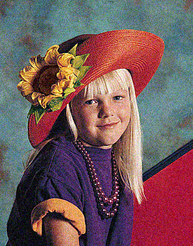

# Image-denoising
Khử nhiễu hình ảnh sử dụng KNN và CUDA

## Overview
Bài báo gốc về thuật toán KNN [this paper](https://developer.download.nvidia.com/compute/cuda/1.1-Beta/x86_website/projects/imageDenoising/doc/imageDenoising.pdf).

## Compilation
Yếu cầu máy tính cần có NVIDIA GPU và môi trường CUDA
Biên dịch chương trình theo thứ tự sau:

``` 
nvcc ./knn_image_denoiser.cu -lpng -o knn_image_denoiser.out
```

Đối với các file khác:

```
gcc -o knn_image_denoiser_omp -fopenmp -lpng knn_image_denoiser_omp.c
gcc -o knn_image_denoiser -lpng knn_image_denoiser.c
```

## Running the application
Để thực hiện đánh giá cần có 2 đối số:
- input image path
- output image path

Ví dụ:
```
./knn_image_denoiser.out input.png output.png
```


## Example images before and after denoising process:

Noisy image                |  Fixed image
:-------------------------:|:-------------------------:
  |  
  |  
  |  
